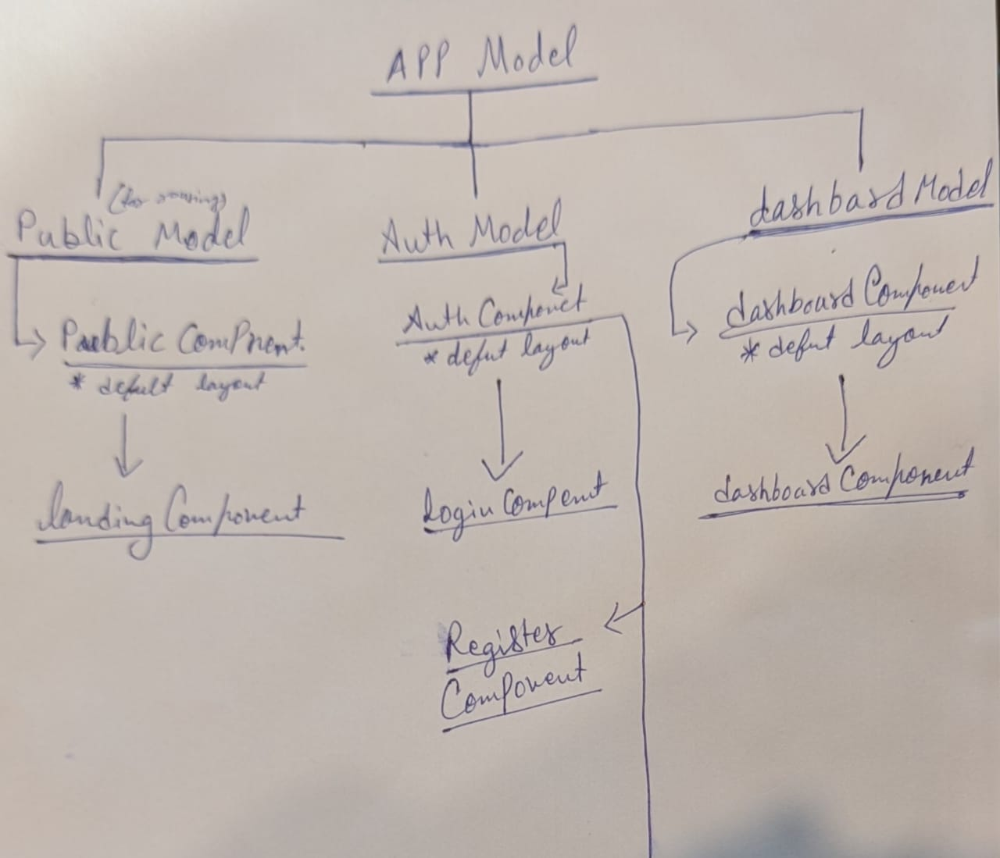

# Bilerplate

This project was generated with angular layout in mind

# File - Structure
  > src -> app 
         > 1. components
                    > 1.  footer
                    > 2.  nav
                    > 3.  sidebar
         > 2. guards
                    > 1. Auth Guard
         > 3. layout
                    > 1. auth
                    > 2. dashbaord
                    > 3. public
        > 4. pages
                    > 1. dashbaord
                    > 2. landing
                    > 3. login
                    > 4. register
        > 5. services
                    > 1. Json-Api Service
                    > 1. Captcha Service
                    > 1. Google-Analitics Service

# Routing Managment

